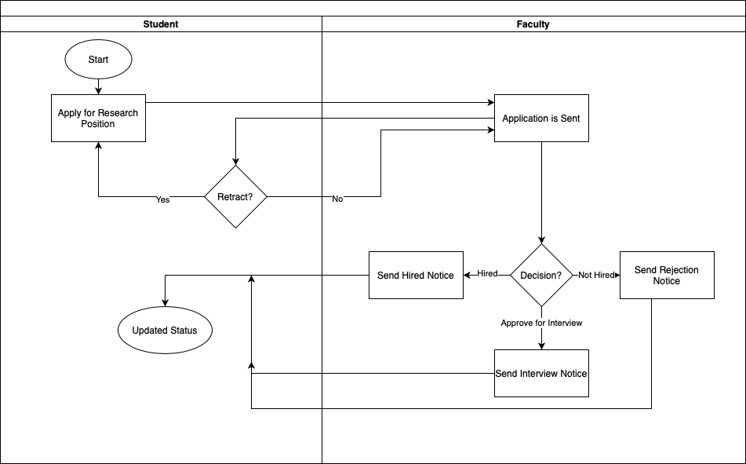
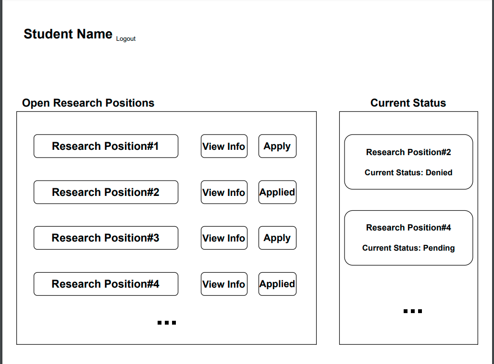

# Software Requirements Specification

## Cougar Research Application Portal
 
--------
**Prepared by:**

* `Kyle Hurd`,`Copy&Submit(CS)`
* `AbdulAziz Al-Dalaan`,`Copy&Submit(CS)`
* `Jake Berreth`, `Copy&Submit(CS)`

---

**Course** : CptS 322 - Software Engineering Principles I

**Instructor**: Sakire Arslan Ay

---

## Table of Contents
- [Software Requirements Specification](#software-requirements-specification)
  - [Cougar Research Application Portal](#cougar-research-application-portal)
  - [Table of Contents](#table-of-contents)
  - [Document Revision History](#document-revision-history)
- [1. Introduction](#1-introduction)
  - [1.1 Document Purpose](#11-document-purpose)
  - [1.2 Product Scope](#12-product-scope)
  - [1.3 Document Overview](#13-document-overview)
- [2. Requirements Specification](#2-requirements-specification)
  - [2.1 Customer, Users, and Stakeholders](#21-customer-users-and-stakeholders)
  - [2.2 Use Cases](#22-use-cases)
    - [2.2.1 Student Use Cases](#221-student-use-cases)
    - [2.2.2 Faculty Use Cases](#222-faculty-use-cases) 
  - [2.3 Non-Functional Requirements](#23-non-functional-requirements)
- [3. User Interface](#3-user-interface)
    - [3.1 Student User Interface](#31-student-user-interface)
    - [3.2 Faculty User Interface](#32-faculty-user-interface)
- [4. References](#4-references)
- [Appendix: Grading Rubric](#appendix-grading-rubric)

## Document Revision History

| Name | Date | Changes | Version |
| ------ | ------ | --------- | --------- |
|Revision 1 |2021-10-05 |Initial draft | 1.0        |

----
# 1. Introduction

This document is an overview of the Cougar Research Application Portal project. It includes Table of Contents and Document Revision History history for easy navigation and version management. It also includes an introduction section that consists of this statement, Document Purpose, Product Scope, and Document Overview sections. These introduce the Software Requirement Specification document and the product that is being created. Following the list of use-cases is a swim-lane diagram, a list of non-functional requirements, a user interface diagram, and a list of references used in the creation of this document and the product. 

## 1.1 Document Purpose

The purpose of the Software Requirement Specification (SRS) document is to outline the functions that the software must perform. This specification is useful because it may be read by the designer of the product to guide the planning and implementation process. It also provides clear documentation, which allows for transparency and minimizes confusion. This is essential because it limits the chances for the product implementation to stray from the initial needs of the client/customer. The document is intended to be read by the product designers/creators and the client. It should only be directly edited by the product designers/creators. 

## 1.2 Product Scope

Though many students falsely assume that only professors or graduate students are involved in research, there are many research opportunities at WSU EECS for undergraduate students. Usually, faculty present the research opportunities in their classes and students who are interested in the project directly contact the faculty. However, if the faculty isnot teaching a lower-level course, they can’t easily reach out to sophomore and junior cohorts. There is a need for an online platform that will allow the faculty advertise their research positions and connect them with the qualified undergraduate students. The product that will be created is a web application where: 
-students can enter their contact information
-completed coursework
-research interests
-prior research experience
-faculty can advertise research opportunities for undergraduate students
-students can apply for research positions
-faculty can select the candidates that they would like to interview with for the position.

## 1.3 Document Overview

The next section is the Requirement Specification. This includes a list of use-cases, a swim-lane diagram, and a list of non-functional requirements. Following this is a user interface diagram and a list of references used in the creation of this document and the product. 

----
# 2. Requirements Specification

This section specifies the software product's requirements. Specify all of the software requirements to a level of detail sufficient to enable designers to design a software system to satisfy those requirements, and to enable testers to test that the software system satisfies those requirements.

## 2.1 Customer, Users, and Stakeholders

**Customers:** Faculty  
**Users:** Faculty, students  
**Stakeholders:** Faculty, students, Washington State University  

----
## 2.2 Use Cases

Below describes the use cases for the software. It is categorized by "Student Use Cases" and "Faculty Use Cases"

---

### 2.2.1 Student Use Cases

| Use case # 1      |   |
| ------------------|-- |
| **Name**              | Create Student Account |
| **Users**             | Students |
| **Rationale**         | When students apply for research positions, the faculty will need some way of tracking who has applied for which positions. This can by done by allowing students to create an account thta includes contact information, completed coursework, research interests, and prior research experience. This will organize the student's information under an account so it is easily viewable and managable. |
| **Triggers**          | User shoose create account option |
| **Preconditions**     | User is a student at WSU |
| **Actions**           | **1.** The user indicates that the software is to perform the funtionality of creating a student account.   **2.** The software responds by requesting the create account page.   **3.** The user inputs registration information and creates an account.   **4.** The software registers the user. |
| **Alternative paths** | **1.** In step 3, the user does not want to create an account and indicates this. Then, the software responds by exiting registration functionality.  |
| **Postconditions**    | The user has created an account.  |
| **Acceptance tests**  | Make sure the user has an account.  |
| **Iteration**         | 1 |

  

| Use case # 2      |   |
| ------------------|-- |
| **Name**              | Student Login with username and password |
| **Users**             | Students |
| **Rationale**         | When users register for the application there needs to be a way to properly verify wheither the user is in fact a student prior to accessing the application. Therefore by making so that a student enters the proper credentials on a page before accessing the full capailities of the application, we will be able to know that the user is a Student. |
| **Triggers**          | Users selects to login option. |
| **Preconditions**     | User has already created a Student account |
| **Actions**           |   **1.** The user indicates that the software is to perform a Student login option   **2.** The software responds by prompting for a Student username and password   **3.** The user enters the proper student credentials (username and password) then indicates to login   **4.**  the credentials that the user enters are valid. |
| **Alternative paths** | **1.** The user indicates that the software is to perform a Student login option   **2.** The software responds by prompting for a Student username and password   **3.** The user enters the proper student credentials (username and password) then indicates to login   **4.**  the credentials that the user enters are invalid and they a prompt the user to create a student account. |
| **Postconditions**    |  The user is logged in as a Student |
| **Acceptance tests**  |  Make sure that the user logs in only with the proper Student credentials   |
| **Iteration**         |  1 |

  

| Use case # 3      |   |
| ------------------| -- |
| **Name**              | View open research positions |
| **Users**             | Students |
| **Rationale**         | Students using this application will be searching for research opportunities at their university. As a convenient way for students to view positions in which professors are actively searching for researchers, a method to view open positions is necessary. |
| **Triggers**          | User selects the open research position option  |
| **Preconditions**     | User has already created an account |
| **Actions**           | **1.** The student indicates that they want to view open research positions   **2.** The software responds by displaying the current open research positions. |
| **Alternative paths** |   |
| **Postconditions**    | The user is now able to view the open research positions  |
| **Acceptance tests**  | Ensure the open research positions are displayed  |
| **Iteration**         | 1 |

  

| Use case # 4      |   |
| ------------------| -- |
| **Name**              | Display Research Position Information |
| **Users**             | Students, faculty |
| **Rationale**         |  When students look for a research position, they will need to have to ability to view open research position information, so that they can choose which positions match with their interests and which positions they would like to apply for. |
| **Triggers**          | User selects view research information option  |
| **Preconditions**     | Logged in as a student  |
| **Actions**           | **1.** The user indicates that the software is to display the research position information for a research position   2. The software responds by displaying the information corresponding to the selected research position|
| **Alternative paths** |   |
| **Postconditions**    | The research position information is displayed |
| **Acceptance tests**  | Ensure sure the research position information is displayed |
| **Iteration**         |  1 |

  

| Use case # 5      |   |
| ------------------| -- |
| **Name**              | Apply for Research Position |
| **Users**             | Students |
| **Rationale**         |  When students find a research position they want, they will need to have to ability to apply for that position. |
| **Triggers**          | User selects apply option  |
| **Preconditions**     | Logged in as a student  |
| **Actions**           | **1.** The user indicates that the software is to perform apply for position funcationality   **2.** The software responds by allowing the user to apply for a research position   **3.** The user enters application information.   **4.** The software responds by submitting the student application|
| **Alternative paths** | **1**. In step 3, the user decides they want to stop applying for a position. The software responds by exit apply functionality.  |
| **Postconditions**    | The user has applied for a position |
| **Acceptance tests**  | Make sure the user's application is linked to the user's account |
| **Iteration**         |  2 |

  

| Use case # 6      |   |
| ------------------ |--|
| **Name**              |  View the research positions they already applied to and check the status of their applications |
| **Users**             | Students  |
| **Rationale**         | When students have applied for research positions, there needs to be a way for them to check the research positions that they have applied to and also check on the current state of their application. |
| **Triggers**          |  User selects the status option |
| **Preconditions**     |  Logged in as a Student |
| **Actions**           |  **1.** The student indicates that they want to view the status of their applications   **2.** The software responds by displaying the status of the applications that they have applied to. |
| **Alternative paths** | **1.** The student indicates that they want to view the status of their applications   **2.** The software responds by displaying that the user has no current applications that they have applied to. |
| **Postconditions**    |  The user can now see the status of their applications |
| **Acceptance tests**  |  Make sure that the user's see the proper status of their applications if any. |
| **Iteration**         |  1 |

  

| Use case # 7      |   |
| ------------------ |--|
| **Name**              | Widthdraw a pending application |
| **Users**             | Student |
| **Rationale**         | When a user applies for a position, they could have made a typo or mistakenly applied for the wrong position. To be able to widthdraw, this would allow the user to |
| **Triggers**          | User indicates they want to retract their application  |
| **Preconditions**     | User has applied to the research position in which they wish to widthdraw |
| **Actions**           | **1.** User indicates they want to widthdraw their application.   **2.** Software responds by removing their application from the selected position. |
| **Alternative paths** | |
| **Postconditions**    | User's application is retracted from the research position. |
| **Acceptance tests**  | User's selected application is removed from the position. |
| **Iteration** | 1|

  

---

### 2.2.2 Faculty Use Cases

| Use case # 1      |   |
| ------------------|-- |
| **Name**              | Create Faculty Account |
| **Users**             | Faculuty |
| **Rationale**         | When students apply for research positions, the faculty will need some way of tracking who has applied for their positions. They also need to be able to post their own research positions. This can be done by allowing faculty to create an account. This will organize the faculty member's information and positions under an account so it is easily viewable and managable. |
| **Triggers**          | User shoose create account option |
| **Preconditions**     | User is a faculty member at WSU |
| **Actions**           | **1.** The user indicates that the software is to perform the funtionality of creating a faculty account.   **2.** The software responds by requesting the create account page.   **3.** The user inputs registration information and creates an account.   **4.** The software registers the user. |
| **Alternative paths** | **1.** In step 3, the user does not want to create an account and indicates this. Then, the software responds by exiting registration functionality.  |
| **Postconditions**    | The user has created an account.  |
| **Acceptance tests**  | Make sure the user has an account.  |
| **Iteration**         | 1 |

  

| Use case # 2      |   |
| ------------------|-- |
| **Name**              | Faculty Login with username and password |
| **Users**             | Faculty |
| **Rationale**         | When users register for the application there needs to be a way to properly verify whether the user is in fact a faculty member prior to accessing the application. Therefore, by making it so that a faculty member enters the proper credentials on a page before accessing the full capailities of the application, we will be able to know that the user is a faculty member. |
| **Triggers**          |  User selects the login option. |
| **Preconditions**     | User has already created a Faculty account |
| **Actions**           |   **1.** The user indicates that the software is to perform a Student login option   **2.** The software responds by prompting for a Student username and password   **3.** The user enters the proper student credentials (username and password) then indicates to login   **4.**  the credentials that the user enters are valid. |
| **Alternative paths** | **1.** The user indicates that the software is to perform a Student login option   **2.** The software responds by prompting for a Student username and password   **3.** The user enters the proper student credentials (username and password) then indicates to login   **4.**  the credentials that the user enters are invalid and they a prompt the user to create a student account. |
| **Postconditions**    |  The user is logged in as a faculty member |
| **Acceptance tests**  |  Make sure that the user logs in only with the proper Student credentials   |
| **Iteration**         |  1 |

  

| Use case # 3      |   |
| ------------------|-- |
| **Name**              | Create Undergraduate Research Position |
| **Users**             | Faculty |
| **Rationale**         |  |
| **Triggers**          |  User selects create position option. |
| **Preconditions**     | User has already created a Faculty account |
| **Actions**           |   **1.** The user indicates that the software is to create a research position.   **2.** The software responds by prompting for a faculty member for position information.   **3.** The user enters the information  **4.** The software responds by creating the position. |
| **Alternative paths** | **1.** In step 3, the user decides they do not want to create the position. The software responds by exiting create position functionality. |
| **Postconditions**    |  The user has created a research position. |
| **Acceptance tests**  |  Make sure that the research position is linked to the faculty account.   |
| **Iteration**         |  2 |

  

| Use case # 4      |   |
| ------------------ |--|
| **Name**              | View the list of students who have applied for open position |
| **Users**             | Faculty |
| **Rationale**         | Faculty users will need to see all of the students who wish to be considered for the posted research position. This is so the faculty member(s) can make an informed decision on who they wish to hire. |
| **Triggers**          | User indicates they wish to see a list of the students who have applied for said research position. |
| **Preconditions**     | Research position is open and posted for students to apply  |
| **Actions**           | **1.** Faculty indicates they want to view the list of students whom have applied for the research position.   **2.** System responds by displaying the list of students who have applied for the position. |
| **Alternative paths** | **1.** Faculty user can see if applicant has been approved for an interview or hired for other research positions |
| **Postconditions**    | List of applicants is displayed  |
| **Acceptance tests**  | The applicants for only the selected research position are displayed  |
| **Iteration**         | 1 |

  

| Use case # 5      |   |
| ------------------|-- |
| **Name**              | View Student Qualifications |
| **Users**             | Faculty |
| **Rationale**         | When a faculty member wants to choose a student for their research position, they will need to view a student's application.  |
| **Triggers**          |  User selects view qualifications option|
| **Preconditions**     | User has already created a Faculty account |
| **Actions**           |   **1.** The user indicates that the software is to perform student qualifications functionality.   **2.** The software responds by prompting for a faculty member for student information   **3.** The user enters the information  **4.** The software responds by displaying student qualifications. |
| **Alternative paths** | **1.** In step 3, the user decides they do not want to view student qualifications. The software responds by exiting view qualifications functionality. |
| **Postconditions**    | The user is viewing student qualifications. |
| **Acceptance tests**  |  Make sure that the student qualifications are being displayed  |
| **Iteration**         |  2 |

  

| Use case # 6      |   |
| ------------------ |--|
| **Name**              | Approve student for interview |
| **Users**             | Faculty |
| **Rationale**         | Once the Faculty user has viewed and looked over a Student's qualifications, and is statisfied with them, there needs to be a way to let the Faculty user approve a student user for an interview |
| **Triggers**          | The Faculty user selects the approve for interview option |
| **Preconditions**     | The student that they are looking to approve or not approve has applied for the reasearch position |
| **Actions**           |  **1.** the Faculty user indicates they want to approve the applicant for a interview.   **2.** The software responds by prompting for the Faculty user if they would like to approve the Student user for an interview   **3.** The Faculty user selects to approve the student for an interview or not.   **4.** The software responds by updating the Student user's application status depending on the Faculty user's choice. |
| **Alternative paths** |  |
| **Postconditions**    | Student's application status is updated to signify they are approved for an interview |
| **Acceptance tests**  | Student's application shows they have been approved or not for interview process |
| **Iteration**         | 3 |

  

| Use case # 7      |   |
| ------------------|-- |
| **Name**              | Update Application Status |
| **Users**             | Faculty |
| **Rationale**         | When a faculty member wants to let students know if a position is closed or not, they can change the stats of the application to reflect if someone has been hired for it or not hired.  |
| **Triggers**          |  User selects update application option |
| **Preconditions**     | User has already created a Faculty account, application must exist |
| **Actions**           |   **1.** The user indicates that the software is to update an application.   **2.** The software responds by prompting user for new status   **3.** The user enters the information  **4.** The software responds by updating the application.|
| **Alternative paths** | **1.** In step 3, the user decides they do not want to view update the application. The software responds by exiting functionality. |
| **Postconditions**    | The status is updated |
| **Acceptance tests**  |  Make sure that the status is correctly updated.  |
| **Iteration**         |  3 |

  

| Use case # 8      |   |
| ------------------ |--|
| Name              | User may delete an existing research position  |
| Users             | Faculty  |
| Rationale         | If the research position is filled or the faculty user no longer wishes for students to apply, they should have an option to remove the research position post. |
| Triggers          | User selects to delete the existing research position  |
| Preconditions     | Research position must be posted and accepting applicants  |
| Actions           | **1.** User indicates they want to remove the research position.   **2.** System responds by removing the research position and making the post unavailable for student users. |
| Alternative paths | **(?) User may edit existing position (?)**  |
| Postconditions    | Research position has been removed and applications for the position will display that it is no longer available  |
| Acceptance tests  | Position has been deleted and applications are updated to reflect position is removed  |
| Iteration         | 3  |

**Include a swim-lane diagram that illustrates the message flow and activities for following scenario:**
“A student applies to a research position; initially its status will appear as “Pending”. The faculty who created that position reviews the application and updates the application status to either “Approved for Interview”, or “Hired”, or “Not hired”. The updated status of the application is displayed on the student view.
The student may delete the pending applications (i.e., whose status is still “Pending”. )”

----
## 2.3 Non-Functional Requirements

List the non-functional requirements in this section.

You may use the following template for non-functional requirements.

**1.** Dependability: The system shall be reliable in terms of all its operations that it may need to perform. 

**2.** Reusability:  The system shall have aspects within it that may be reused wheiter it be for present or future purposes. 

**3.** Portability:  The system shall be able to perform equivalently in all devices, web browsers (chrome and firefox), operating systems.    

**4.** Performance:  The system shall be able to both consistently and effectively.  

**5.** Security:  The system shall not disclose any personal user information.

----
# 3. User Interface

## 3.1 Student User Interface

## 3.2 Faculty User Interface

----
# 4. References

Cite your references here.

For the papers you cite give the authors, the title of the article, the journal name, journal volume number, date of publication and inclusive page numbers. Giving only the URL for the journal is not appropriate.

For the websites, give the title, author (if applicable) and the website URL.

----
----
# Appendix: Grading Rubric
(Please remove this part in your final submission)

These is the grading rubric that we will use to evaluate your document. 

| Max Points  | **Content** |
| ----------- | ------- |
| 10          | Do the requirements clearly state the customers’ needs? |
| 5           | Do the requirements avoid specifying a design (note: customer-specified design elements are allowed; non-functional requirements may specify some major design requirements)? |
|    | **Completeness** |
| 25 | Are use cases written in sufficient detail to allow for design and planning? |
| 4 | Do use cases have acceptance tests? | 
| 20 | Is your use case model complete? Are all major use cases included in the document? |
| 8 | Has the team provided an appropriate swim-lane diagram for the scenario where faculty reviews a student’s application? |
| 10 |  Are the User Interface Requirements given with some detail? Are there some sketches, mockups?  |
|   | **Clarity** |
| 4 | Is the document carefully written, without typos and grammatical errors? |
| 2 | Is each part of the document in agreement with all other parts? |
| 2 | Are all items clear and not ambiguous? (Minor document readability issues should be handled off-line, not in the review, e.g. spelling, grammar, and organization). |
|    | **GitHub Issues** |
| 10 | Has the team setup their GitHub Issues page? Have they  generated the list of user stories, use-cases, created milestones, assigned use-cases (issues) to milestones?   Example GitHub repo (check the issues): https://github.com/WSU-CptS322-Fall2021/TermProjectSampleRepo/issues |

