

# Design Document

## Cougar Research Application Portal

  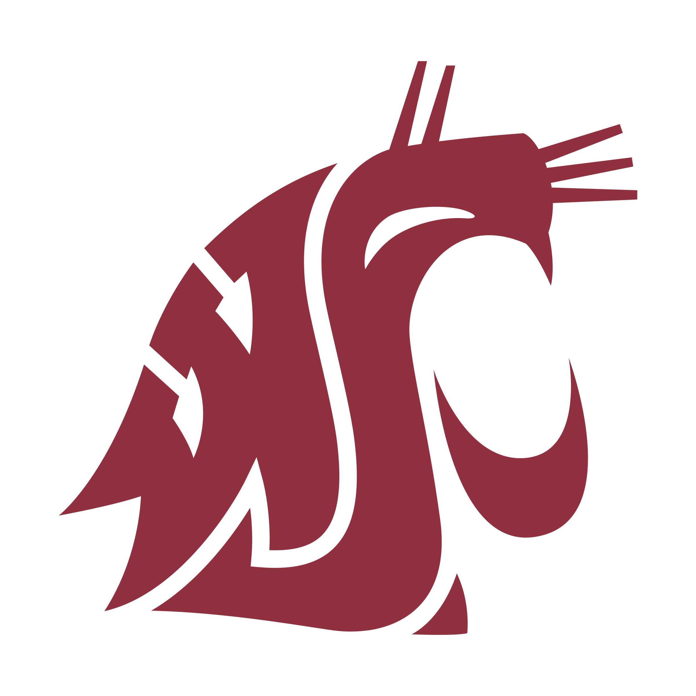

<b>Prepared by</b>

`Kyle Hurd` - `Copy&Submit`  
`AbdulAziz Al-Dalaan` - `Copy&Submit`  
`Jake Berreth` - `Copy&Submit`  

---

**Course** : CptS 322 - Software Engineering Principles I

**Instructor**: Sakire Arslan Ay

---

## Table of Contents
- [Design Document](#design-document)
  - [Cougar Research Application Portal](#cougar-research-application-portal)
  - [Table of Contents](#table-of-contents)
  - [Document Revision History](#document-revision-history)
- [1. Introduction](#1-introduction)
- [2.	Architectural and Component-level Design](#2-architectural-and-component-level-design)
  - [2.1 System Structure](#21-system-structure)
  - [2.2 Subsystem Design](#22-subsystem-design)
    - [2.2.1 Model](#221-model)
    - [2.2.2 Controller](#222-controller)
    - [2.2.3 View and User Interface Design](#223-view-and-user-interface-design)
- [3. Test Plans](#3-test-plans)
- [4. Progress Report](#4-progress-report)
- [5. References](#5-references)

## Document Revision History

| Name | Date | Changes | Version |
| ------ | ------ | --------- | --------- |
|Revision 1 |2021-10-27 |Initial draft | 1.0        |
|Revision 2 |2021-11-16 |Second draft | 1.0         |

# 1. Introduction

The purpose of this design document is to provide documentation for the design of the Cougar Research Application Portal. This ensures that project implementation is efficient by laying out a plan ahead of time. It also ensures that the design of the project and the final product matches the software requirements, as expounded in the Software Requirement Specification. 

- This document explains the high level functionality of the system and the interdependencies between subsystems that makeup the project.  

At Washington State University, there are opportunities for undergradutae students to become involved in research. However, there is not always effective communication between faculty and students about these opportunities. Therefore, there is a need for an online platform that will enable faculty to advertise research positions that students may apply for. The product that will be created is a web application where: 

#### <b>Students</b> 
- Can enter their contact information, completed coursework, research interests, and prior research experience

- Can apply for research positions

#### <b>Faculty</b>
- Can advertise research opportunities for undergraduate students

- Can select the candidates that they would like to interview for the position

---

#### The goal of this document...

Is to define the design of the project and the classes or subsystems that will be used to implement the project.

[Section II](#2-architectural-and-component-level-design) includes the architecture and component-level design of the system. This includes the system structure in terms of the model, controller, and view subsystems.

[Section III](#3-progress-report) is a brief summary of the progress that has been made on the project. This is a Progress Report.

[Section IV](#4-references) provides any references that were used in the process of creating this design document. 

# 2.	Architectural and Component-level Design
## 2.1 System Structure

The three main subsystems in the architectural design are the Model, Controller, and the View. The Model manages the database and major operations of the software, the View manages what the user sees, and the Controller allows for interactions between the View and the Model through inputs and outputs. 

The proposed decomposition was made more efficient by using polymorphism, which allows for the reusing of code to create different models. Polymorphism allows us to create a Faculty and Student Model off of User. This is beneficial as we can provide the base User Model with the login functionality and treat Student and Faculty accounts as the same during the register and login processes. Also, this allows us to query Student and Faculty simultaneously as well as individually, which is a much desired feature for future development. It makes our User Account Models highly cohesive. Also, having three main subsystems into which the project is organized, contributes to high cohesion. The Model does not directly depend on the View, and the View does not directly depend on the Model. Both go through the Controller, which allows for low coupling. 

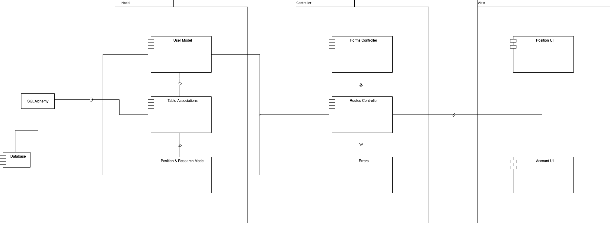

The follow UML diagram shows the models and the interactions between the models and tables implemented in the project. 

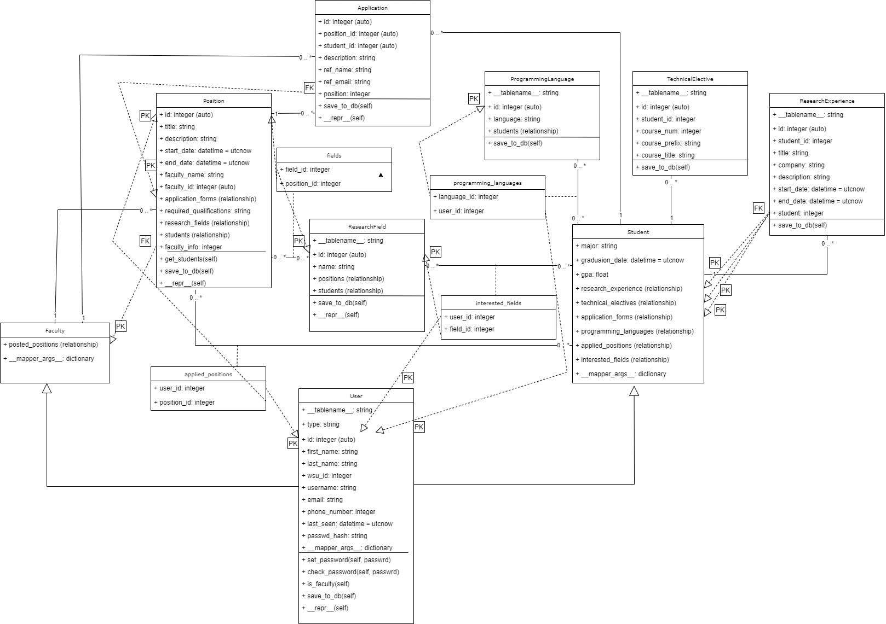

## 2.2 Subsystem Design 

### 2.2.1 Model

The Model subsystem is used to manage data structures, databases, and anything that governs the actions of an application.

- ### <b>User</b>

Base class for the User Account Model, Contains the base data for all user types (Faculty and Student Users)

| Attributes | Description |  
| ---------- | ----------- |
| type | name of the defined user (i.e., Student or Faculty)|
| id | id of the user within the database |
| first_name | the user’s first name |
| last_name | the user’s last name |
| wsu_id | the user’s WSU id |
| username | the user’s WSU username |
| email | the user’s respected email |
| phone_number | the user’s respected phone numbers |
| last_seen | value that saves the last time the user has logged. |
| passwd_hash | Encrypted password for respected user |

- ### <b>Faculty</b>

Polymorphic class of the user class that only contains attributes that only adhere to the Faculty user. 

| Attributes | Description |
| -- | -- |
| posted_positions | a one-to-many relationship between the Faculty user and the positions that they have posted. |

- ### <b>Student</b>  

Polymorphic class of the user class that only contains attributes that only adhere to the Student user. 

| Attributes | Description |
| -- | -- |
| major             | a string of the user's major. |
| graduation_date   | a DateTime of the expected graduation date (mm/dd/yyyy). |
| gpa               | a float value of the student's current grade point average. |
| technical_electives | a one-to-many relationship between the Student and TechnicalElective Model. |
| research_experience | a one-to-many relationship between the Student and ResearchExperience Model. |
| application_forms | a one-to-many relationship between the Student and Application Model. |
| programming_languages | a many-to-many relationship between the Student and ProgrammingLanguage Model. |
| applied_positions | a many-to-many relationship between the Student users and the positions that they have applied to in the database. |
| interested_fields | a many-to-many relationship between the Students users and the research fields that they are interested in that are in the database. |

- ### <b>ResearchField</b>

Model that contains all the Research Fields that Students are interested in, and ones that posts are related to. 

| Attributes | Description |
| -- | -- |
| id |  id of a research field in order to store it in a database |
| name | the name of a given research field			 |
| positions | many-to-many relationship between both the research field and the research positions in the database. 
| students | many-to-many relationship between both the research field and the students users and the research fields that are in the database | |

- ### <b>Position</b>

Class that contains all information/attributes related to a Research Position which are created by a Faculty user and both Students and Faculty are able to view specific attributes from it. 

| Attributes | Description |
| -- | -- |
| id | the id of the research position in the database |
| title | the name of the research position |
| description | the body description that mentions the details of the research position |
| start_date | the date of initiation for the research position |
| end_date | the date of conclusion for the research position |
| time_commitment | the amount of hours to commit to the research position |
| faculty_name | the name of the faculty user that created the research position |
| faculty_id | the id of the faculty user that created the research position |
| application_forms | a one-to-many relationship between Position and Application Models. |
| required_qualifications | the body descriptions that mentions the requirements that the student users must meet prior to applying to the research position |
| research_fields | many-to-many relationship between the research positions and the research field tags |
| students | many-to-many relationship between the research positions and the student users that have applied to said research positions |  

- ### <b>Application</b>  

Model containing information necessary for an application. The application form is filled out by a Student and sent to the Position for
which they applied.  

| Attributes | Description |
| -- | -- |
| id | the id of the Application for the database. |
| position_id | a one-to-many relationship between the Position and Application Model. |
| student_id  | a one-to-many relationship between the Student and Application Model. |
| student_name | a string containing the applicant's name. |
| description | a string containing the reason for applying for said position. |
| ref_name | a string containing the reference's name. |
| ref_email | a string containing the reference's email. |  

- ### <b>ProgrammingLanguage</b>

Model containing information necessary for students to post their interested programming languages.

| Attributes | Description |
| -- | -- |
| id | the id of the ProgrammingLanguage Model for the database. |
| language | a string representing a specific programming language. |
| students | a many-to-many relationship between Student and ProgrammingLanguage Model. |

- ### <b>ResearchExperience</b>

Model containing information necessary for student to post their research experience.

| Attributes | Description |
| -- | -- |
| id | the id of the ResearchExperience for the database. |
| student_id | a one-to-many relationship between Student and ResearchExperience Model. |
| title | a string containing the title of the research experience. |
| company | a string containing the company name for which the research experience took place. |
| description | a string containing the descritpion of duties/other things that occured during the duration of the position. |
| start_date | a DateTime containing the date in which the position started. |
| end_date | a DateTime containing the date in which the position ended. |  

- ### <b>TechnicalElective</b>  

Model containing information regarding a technical elective a student has taken.  

| Attribute | Description |
| -- | -- |
| id | the id of the TechnicalElective for the database. |
| student_id | a one-to-many relationship between Student and TechnicalElective Model. |
| course_num | an integer containing the course number. |
| course_prefix | a string containing the prefix of the course. |
| course_title | a string containing the title of the course taken. |
| course_description | a string containing a description of what subjects or topics were studied for the course. |

### 2.2.2 Controller

The Controller manages interactions between the View and the Model. It takes input from the user and outputs the results to the Model or View.  

| Routes Name | Methods           | URL Path      | Description  |
|:------------|:------------------|:--------------|:-------------|
| index     | GET               | / and /index  |  Once the user is logged in as a defined user, they go to this page, where they can see all the research positions that are currently within the database. They are able to view all of them on this page. This interacts with the database as this page requests the research positions within the database and then posts them. The route interacts with the model subsystem, specifically the Position model.            |
| display_position          |  GET                 | /position/<pos_id>           | Once a Faculty defined user has posted a research position they have this page for that said research position created as well, this page is used to display a single research position and show all the attributes that are within that said research position on this page. From this page students are able to view all the information about the said position. This route interacts with the one single Position model at a time with its position id in order to grab all the information from that select position id’s position. For this page to be viewed, the position must be visible on the index page in order to find this said route and the user has to be logged in as a defined user. The route interacts with the model subsystem, specifically the Position model.                 |
| create_position          | GET and POST                  | /create_position           |  Once the user is logged in as a Faculty defined user, they are able to use this stated route in order to create their own research position, then submit it and once they do it will be visible on the index page for both the Student and Faculty user’s to see. The route will first check if the logged in user is in fact a Faculty user, then once this is validated and instance of a CreatePositionForm is generated and the Faculty user’s input information into the form is then saved to the database and then they are redirected to the index page and are able to see that their position is automatically posted to the index page. This route interacts with the controller subsystem, specifically the position form.            |
| login          | GET and POST                  | /login           | This page is used to block none defined user from entering the index page as the user has to register a defined account in order to have access to the index page (i.e., if the user is not logged in and tries to go to another other page, they will instead be redirected to this one until they are logged in). The user must input a valid email and password that they have defined when creating an account in order to login on this said page. This route interacts with the controller subsystem, specifically the login form in authentication forms.                |
| register          | GET and POST                  | /register            | If the user has not created a defined user account (i.e., a Student or Faculty account) and they are not logged in, on the login page they can select to go to the register page to input their personal information for a defined user and then submit the registration form with their information. This route interacts with the information of all the users in order to make sure that the new user does not use an already created one’s information within their account details. The route interacts with the model subsystem, specifically the Position model.                |
| logout          | None                  | /logout           | If the user is logged into the application and would instead be signed out of their account on this application, they can utilize this route in order log out of the application and once they do, they will be redirected to the login page. The route interacts with the model subsystem, specifically the Position model. |
| view_applicants          | GET                  | /view_applicants            | This will allow a faculty user to view the students who have applied for each of their posted positions. This will help them clearly understand what their options are, and have something to quickly scan and come back to when the want to view each student's credentials. This route intreracts with the Position model. |
| display_applicant_info          | GET                  | /student/<student_id>            | This will allow the faculty user to examine each applicant's specific qualifications and information, which is integral to their decision of who would be the best candidate for the position. This route interacts with the User model. (The template for this specific route was not finalized yet, but will be in iteration 3) |
| apply          | GET and POST             | /apply/<pos_id>            | This is essential because it allows student to navigate to a page that contains the Application form. This will allow them to apply for positions of their choosing. Without the ability to apply for a position, a student cannot be put in the running to receive a position. This route interacts with the Position and Application models. The route interacts with an     application form within application_forms in the Controller. |
| technical_electives          | GET                  | /technical_electives            | This will allow a student and faculty to view the specific technical electives they have taken as courses. This is part of the main information that faculty will be looking at when deciding who to choose for a position. This route interacts with the User model in the Models subsystem. |
| create_technical_elective          | GET and POST                  | /create_technical_elective            | This route allows the student user to enter in information regarding a technical elective that they have taken or taking that they want to show up on their account for the faculty user to see once they apply for a position. The route interacts with the Model subsystem, specially with TechnicalElective model, as well as the Controller subsystem, specially the EditTechnicalElectiveForm form.  |
| research_experience          | GET                  | /research_experience            | This will allow a student and facult to view the specific research experience they have. This is part of the main information that faculty will be looking at when deciding who to choose for a position. This route interacts with the User model in the Models subsystem. |
| create_research_experience          | GET and POST                  | /create_research_experience            | This route allows the student user to enter in information regarding research experience that they have that they want to show up on their account for the faculty user to see once they apply for a position. The route interacts with the Model subsystem, specially with ReasearchExperience model, as well as the Controller subsystem, specially the EditReasearchExperienceForm form.  |
| edit          | GET and POST                | /edit           | This will allow a student to edit their information, which is what the faculty will see when choosing who to give a position or who to interview. It is essential that students can modify their information, so that it correctly reflects new experiences that were not originally linked to their account. This route interacts with the User model in the Models subsystem. |

### 2.2.3 View and User Interface Design 

The role of the view is to render the information retrieved through the controller, on the screen. The view provides something for the user to view and interact with. This includes HTML and CSS code, in which HTML structures a web page and CSS styles a web page. The HTML templates in the View section of the project file structure, are rendered when a route is entered. A Flask form is sent to the template, which allows the HTML code to include Flask form fields to get user input. 

- Under View > Static, there is a CSS file that provides all styling.

- Under View > Templates, there are HTML files for different items to be rendered on the screen. There are HTML files to display a single position, the create position form, the main/index page and all open positions, the login form, the page that presents information about a single position, and the register form. There is also a file that provides the content that will be rendered on every page, like the navigation bar and navigation buttons.

- The Create Student Account and Create Faculty Account use-cases are fulfilled by the view, which allows for the rendering of a registration form that the user enters information into to create an account. 

- The Student Login and Faculty Login use-cases are fulfilled by view, through the Login Form, which is sent to the HTML file that displays the form elements to get user input. 

- The View Open Research Positions use-case is fulfilled by the view functionality that is rendered in the index.html file. 

- The Display Research Position Information use-case is fulfilled by the position.html file, which is sent a position model.

- The Create Undergraduate Research Position use-case is fulfilled by the create position HTML template, which displays the elements of the CreateResearchPosition form. 

## Screenshots

#### Index

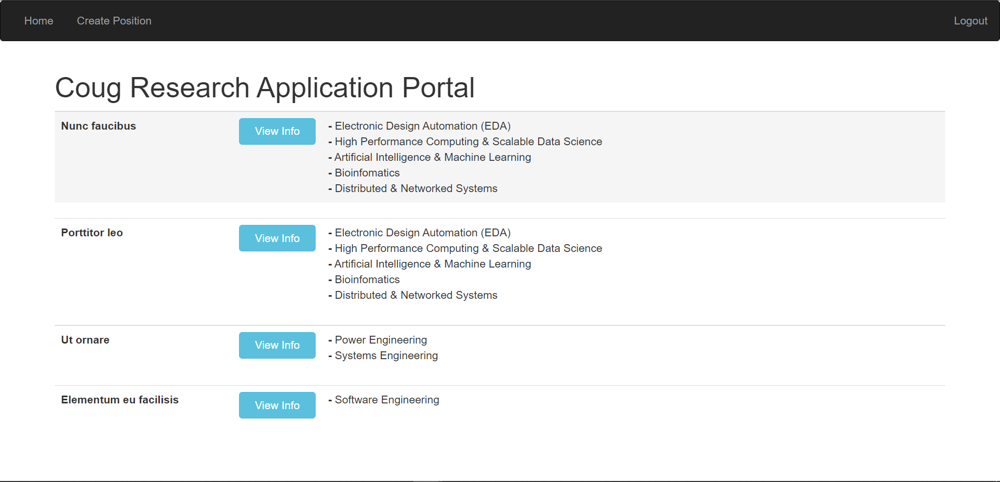

#### Login

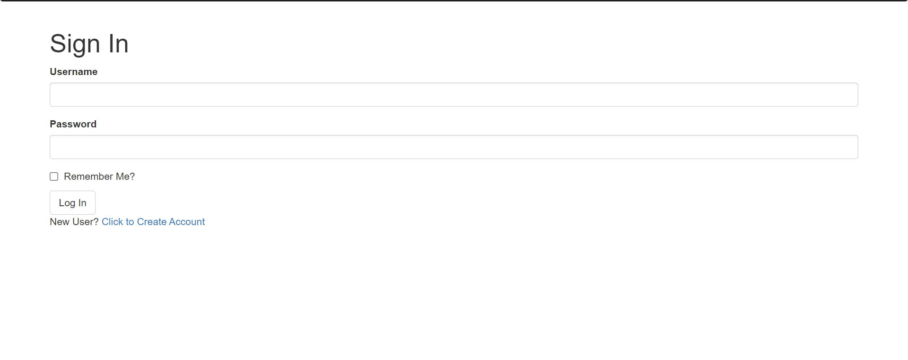

#### Position

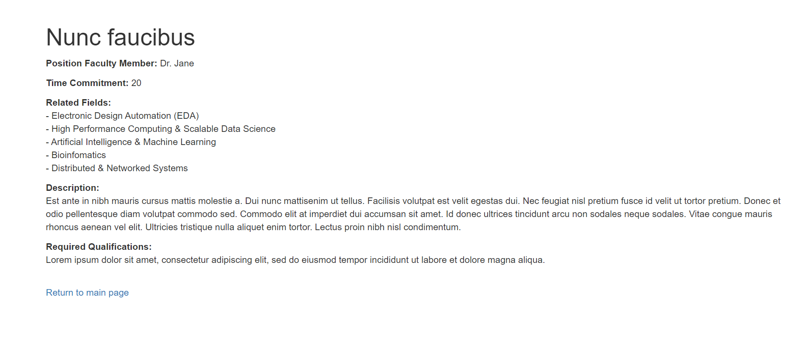

#### Register 1

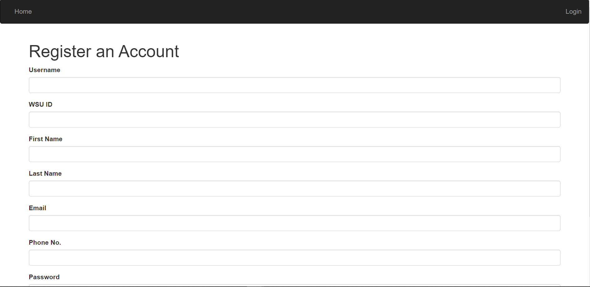

#### Register 2

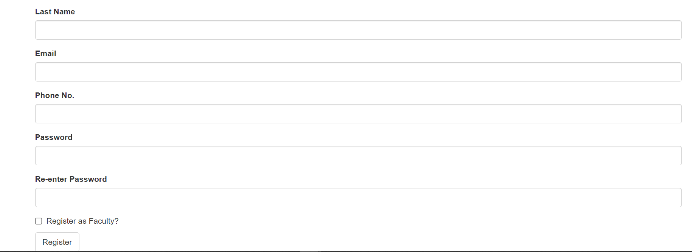

#### Create Position 1

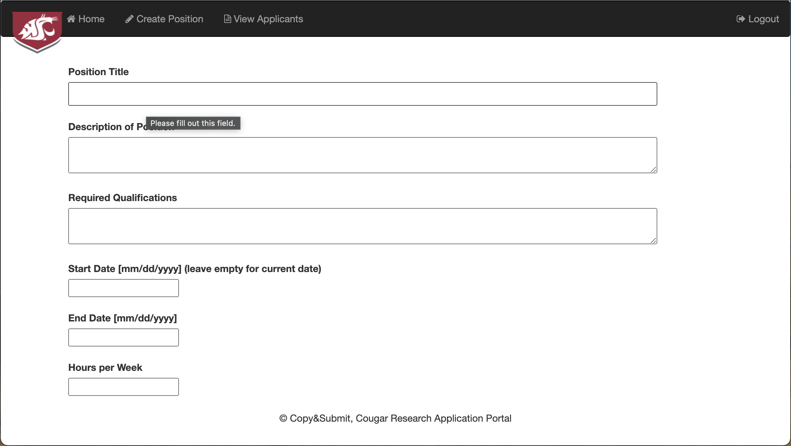

#### Create Position 2

  
#### Active Research Positions
 

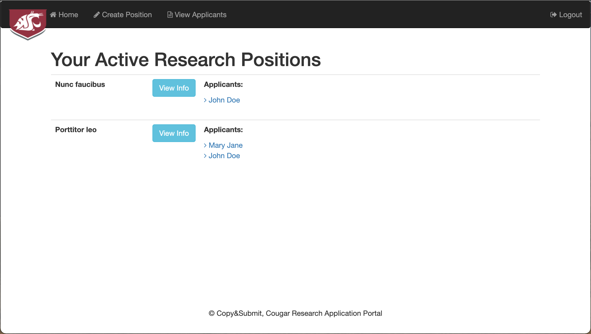

#### Edit Prior Experience

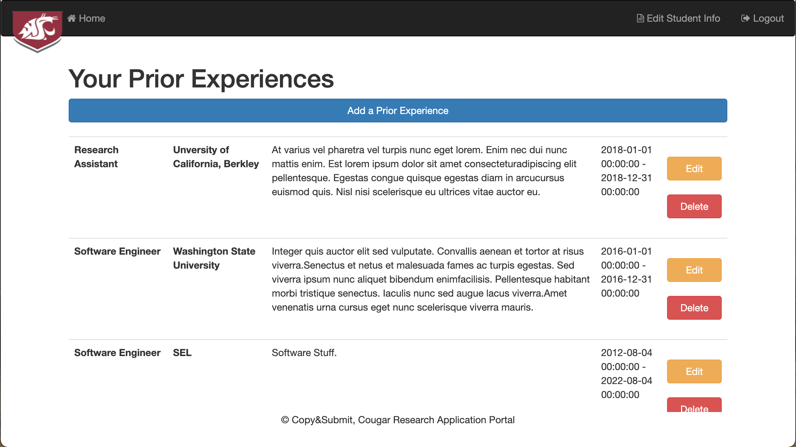

  
#### Edit Student Info
  

#### Edit Technical Electives

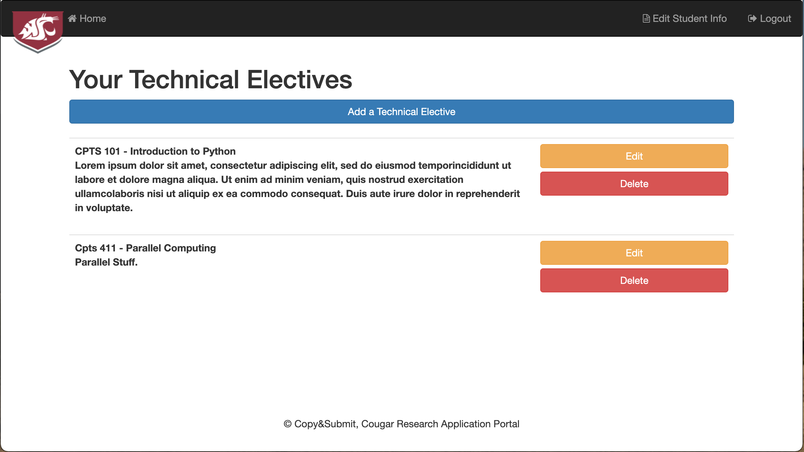  

# 3. Test Plans  

For iteration 3 we will need to add test cases for the following locations:
  - Tests for current route implementation (the page links go to the correct route)
  - Tests for database functionality (Models are correctly added and associations work as expected.)
  - Manually testing for the user interface (Design is good and no problems with styling.)

# 4. Progress Report

In Iteration 2, we implemented more features regarding applying for a position and viewing the applicants of a position. Additionally, we
completed the edit fields for student information, however we still need to implement the edit and delete buttons for the students whom have applied
and for the faculty whom have posted open positions. Additionally, we need to add the student's current status for the applied position:
pending, interview, rejected, approved.  

- In the edit forms, a student can update their technical electives and research experience pages. This will eventually be displayed on their
profile when submitting an application for a research position, along with other information such as gpa, graduation date, etc.  
- Faculty can now view the names of the students who have applied for their open research positions. However, they cannot view their full application.  
- Made changes to the UI in some forms that were showing overlap between sections of the form.

# 5. References

No references were used in this project.
