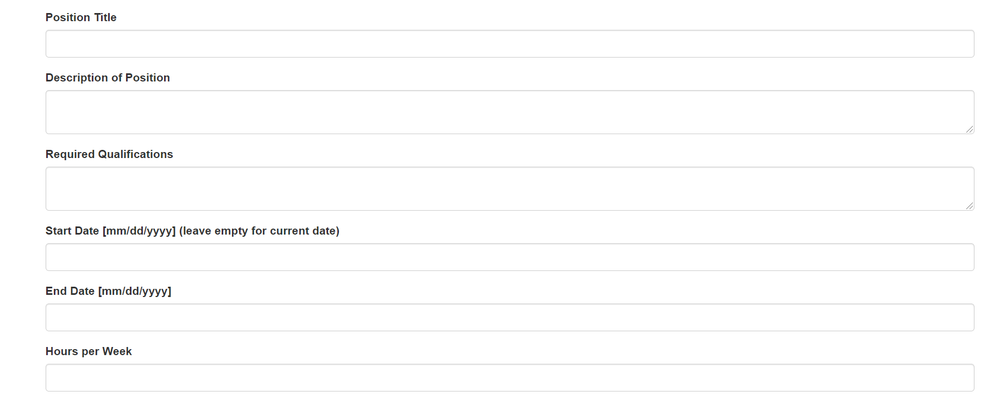

# Design Document

## Cougar Research Application Portal

  

<b>Prepared by</b>

`Kyle Hurd` - `Copy&Submit`  
`AbdulAziz Al-Dalaan` - `Copy&Submit`  
`Jake Berreth` - `Copy&Submit`  

---

**Course** : CptS 322 - Software Engineering Principles I

**Instructor**: Sakire Arslan Ay

---

## Table of Contents
- [Design Document](#design-document)
  - [Cougar Research Application Portal](#cougar-research-application-portal)
  - [Table of Contents](#table-of-contents)
  - [Document Revision History](#document-revision-history)
- [1. Introduction](#1-introduction)
- [2.	Architectural and Component-level Design](#2-architectural-and-component-level-design)
  - [2.1 System Structure](#21-system-structure)
  - [2.2 Subsystem Design](#22-subsystem-design)
    - [2.2.1 Model](#221-model)
    - [2.2.2 Controller](#222-controller)
    - [2.2.3 View and User Interface Design](#223-view-and-user-interface-design)
- [3. Progress Report](#3-progress-report)
- [4. References](#4-references)

## Document Revision History

| Name | Date | Changes | Version |
| ------ | ------ | --------- | --------- |
|Revision 1 |2021-10-27 |Initial draft | 1.0        |

# 1. Introduction

The purpose of this design document is to provide documentation for the design of the Cougar Research Application Portal. This ensures that project implementation is efficient by laying out a plan ahead of time. It also ensures that the design of the project and the final product matches the software requirements, as expounded in the Software Requirement Specification. 

- This document explains the high level functionality of the system and the interdependencies between subsystems that makeup the project.  

At Washington State University, there are opportunities for undergradutae students to become involved in research. However, there is not always effective communication between faculty and students about these opportunities. Therefore, there is a need for an online platform that will enable faculty to advertise research positions that students may apply for. The product that will be created is a web application where: 

#### <b>Students</b> 
- Can enter their contact information, completed coursework, research interests, and prior research experience

- Can apply for research positions

#### <b>Faculty</b>
- Can advertise research opportunities for undergraduate students

- Can select the candidates that they would like to interview for the position

---

#### The goal of this document...

Is to define the design of the project and the classes or subsystems that will be used to implement the project.

[Section II](#2-architectural-and-component-level-design) includes the architecture and component-level design of the system. This includes the system structure in terms of the model, controller, and view subsystems.

[Section III](#3-progress-report) is a brief summary of the progress that has been made on the project. This is a Progress Report.

[Section IV](#4-references) provides any references that were used in the process of creating this design document. 

# 2.	Architectural and Component-level Design
## 2.1 System Structure

This section should describe the high-level architecture of your software:  i.e., the major subsystems and how they fit together. 
If you adopted the application structure we used in the Smile App, your application would have the Model-View-Controller (MVC) pattern. If you adopted a different architectural pattern, mention the pattern you adopted in your software and briefly discuss the rationale for using the proposed architecture (i.e., why that pattern fits well for your system).

In this section:
 * Provide a UML component diagram that illustrates the architecture of your software.
 * Briefly explain the role of each subsystem in your architectural design and explain the dependencies between them. 
 * Discuss the rationale for the proposed decomposition in terms of cohesion and coupling.

## 2.2 Subsystem Design 

### 2.2.1 Model

Briefly explain the role of the model.  

(***in iteration-1***) Include a list of the tables (models) in your database and explain the role of each table. Provide the attributes of the tables and briefly explain each attribute. 

### 2.2.2 Controller

Briefly explain the role of the controller. If your controller is decomposed into smaller subsystems (similar to the Smile App design we discussed in class), list each of those subsystems as subsections. 

For each subsystem:
 * Explain the role of the subsystem (component) and its responsibilities.
 * 	Provide a detailed description of the subsystem interface, i.e., 
    * which other subsystems does it interact with?  
    * what are the interdependencies between them? 

**Note:** Some of your subsystems will interact with the Web clients (browsers). Make sure to include a detailed description of the  Web API interface (i.e. the set of routes) your application will implement. For each route specify its “methods”, “URL path”, and “a description of the operation it implements”.  
You can use the following table template to list your route specifications. 

(***in iteration-1***) Brainstorm with your team members and identify all routes you need to implement for the completed application and explain each route briefly. If you included most of the major routes but you missed only a few, it maybe still acceptable. 

|   | Methods           | URL Path   | Description  |
|:--|:------------------|:-----------|:-------------|
|1. |                   |            |              |
|2. |                   |            |              |
|3. |                   |            |              |
|4. |                   |            |              |
|5. |                   |            |              |
|6. |                   |            |              |

### 2.2.3 View and User Interface Design 

The role of the view is to render the information retrieved through the controller, on the screen. The view provides something for the user to view and interact with. This includes HTML and CSS code, in which HTML structures a web page and CSS styles a web page. The HTML templates in the View section of the project file structure, are rendered when a route is entered. A Flask form is sent to the template, which allows the HTML code to include Flask form fields to get user input. 

- Under View > Static, there is a CSS file that provides all styling.

- Under View > Templates, there are HTML files for different items to be rendered on the screen. There are HTML files to display a single position, the create position form, the main/index page and all open positions, the login form, the page that presents information about a single position, and the register form. There is also a file that provides the content that will be rendered on every page, like the navigation bar and navigation buttons.

- The Create Student Account and Create Faculty Account use-cases are fulfilled by the view, which allows for the rendering of a registration form that the user enters information into to create an account. 

- The Student Login and Faculty Login use-cases are fulfilled by view, through the Login Form, which is sent to the HTML file that displays the form elements to get user input. 

- The View Open Research Positions use-case is fulfilled by the view functionality that is rendered in the index.html file. 

- The Display Research Position Information use-case is fulfilled by the position.html file, which is sent a position model.

- The Create Undergraduate Research Position use-case is fulfilled by the create position HTML template, which displays the elements of the CreateResearchPosition form. 

## Screenshots

#### Index

#### Login

#### Position

#### Register 1

#### Register 2

#### Create Position 1

#### Create Position 2

# 3. Progress Report

In Iteration 1, the foundation of the project has been set up. The project is divided into three major sections: Model, Controller, and View. In Model, there are ResearchField, Position, User, and Faculty (from User) models. 
- In Controller, there are forms and routes. The forms are Register and Login FlaskForms. There are authorization routes, which contain routes pertinent to user authentication. There are also regular routes, which contain all other routes. The auth routes contain Login, Logout, and Register routes. The regular routes contain Index, Display Position, and Create Position routes.
- In the view, there is a CSS stylesheet and a set of HTML templates that render form or model elements to the screen upon a certain route being entered. 

# 4. References

No references were used in this project.